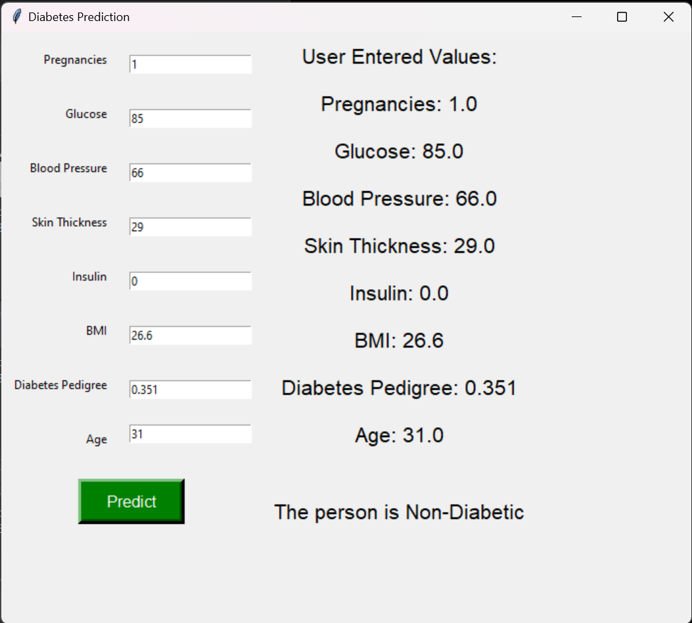

**Diabetic-Analysis-and-Prediction**

Diabetic Analysis and Prediction with Tkinter UI

To run the file clone the repo using:-  git clone https://github.com/OGMAN28/Diabetic-Analysis-and-Prediction.git

Install libraries

pip install numpy

pip install pandas

pip install sklearn

pip install tkinter

**Run  Diabetic Analysis and Prediction.py**

.....................................................................xxx......................................................................................
**Screenshots**

